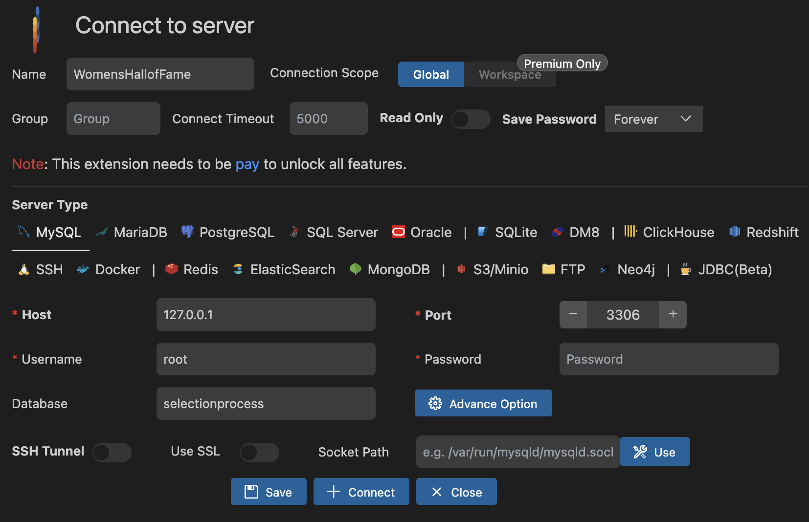

# Backend Database Configuration
## Prerequisites

1. MySQL installed

   NOTE: make sure you know your username and password for your local mysql instance

   If you do not know the username and password you can add execute the following sql queries in an IDE that supports sql

   ```sql
   ALTER USER 'root'@'localhost' IDENTIFIED WITH mysql_native_password BY 'password';
   
   flush privileges;
   ```

   ## Requirements

   1. Install Following VSCode MySQL Extension:

      **`cweijan.vscode-mysql-client2`**

      a. Create connection to a server using default settings

      ​	**Name:** `PLACEHOLDER` *NOTE: name this anything you want*

      ​	**Host:** `127.0.0.1`

      ​	**Port:** `3306`

      ​	**Username:** `PLACEHOLDER` *NOTE: this should be the same username used for your local mysql db instance*

      ​	**Password:** `PLACEHOLDER` *NOTE: this should be the same password used for your local mysql db instance*

      ​	**Database:** `selectionprocess`

      


2. In the **`backend/config`** directory create a file called **`db.config.js`**:

   ```js
   module.exports = {
     HOST: "localhost",
     PORT: 3306,
     USER: "{PLACEHOLDER}",
     PASSWORD: "{PLACEHOLDER}",
     DB: "selectionprocess"
   };
   ```

   ​	**NOTE:** replace `PLACEHOLDER` with your local db username and password

3. Create a folder call `test` in the backend root directory the following queries into the `backend/app/tests/` folder to create and initialize tables
    **`createDB.sql`** -- used to create tables

    **`setupDB.sql`** -- to run a query and populate some tables with static information

    **`Nominations.sql`** -- dummy data

    **`Judges.sql`** -- dummy data

4. Within the **`backend`** directory run the following commands:

   ```bash
   npm install
   ```

   ```bash
   npm run dev
   ```

5. Go to [Nomination Test Connection](http://localhost:8080/nominations) and you should see at least one nomination populated.

   